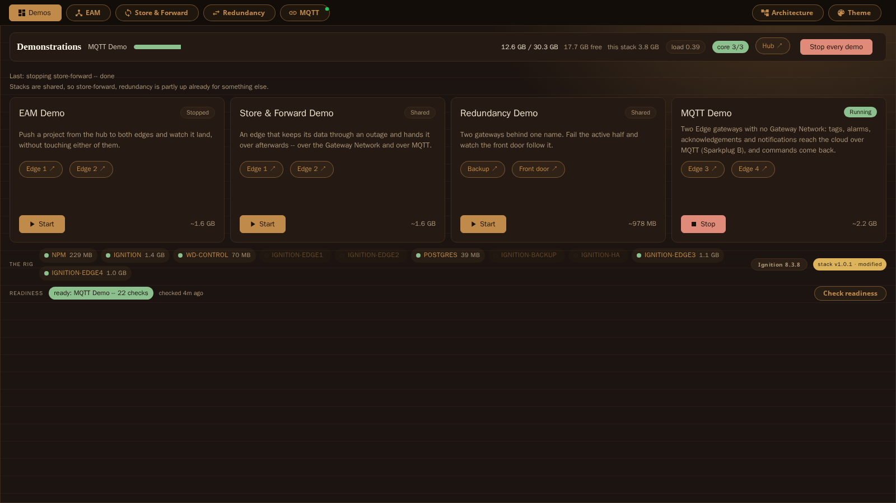
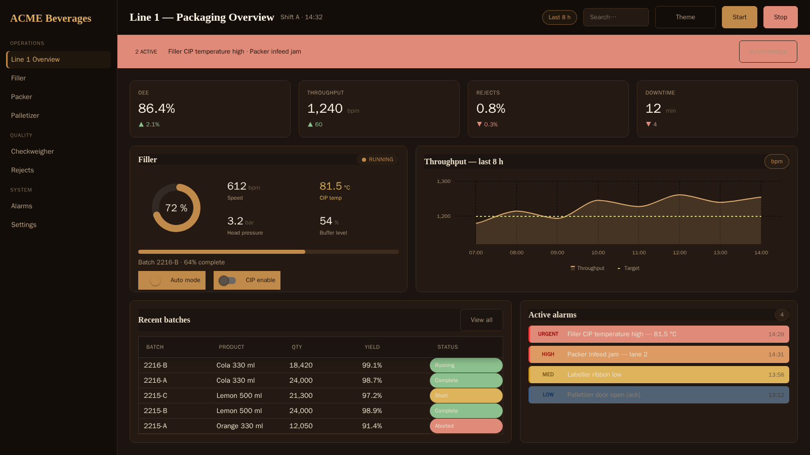
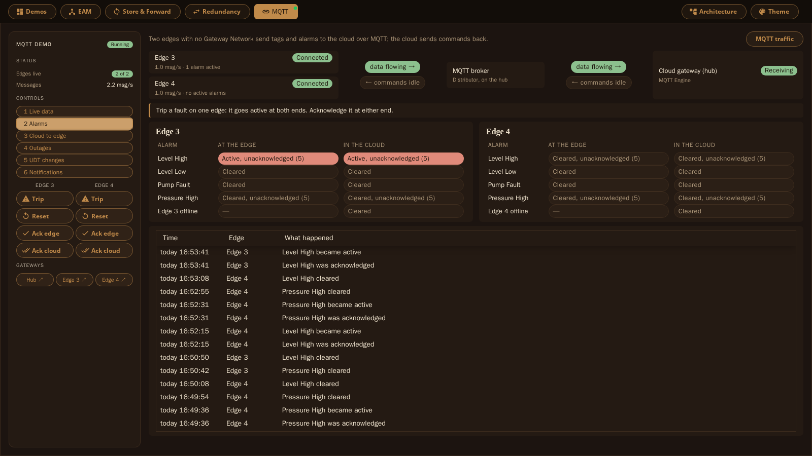

# Ignition-Demos-Stack

A hub-and-spoke Ignition demonstration stack — one Standard gateway (a
redundant pair that is also the MQTT broker), Edge spokes, Postgres and a demo
console — that runs on
macOS, Windows or Linux from a plain `git clone`.

## Why this exists

Explaining Ignition's platform features in the abstract is not the same as
watching them happen: a project pushed from a hub landing on an edge, a broker
link cut and its buffered minute arriving intact, a gateway failing over with
the browser still pointed at the same URL. This stack builds that environment
on a laptop in one command, so any of Ignition's cross-gateway behaviour can be
shown live rather than described in a slide.

## What it looks like


*The console: start only the demonstration you're about to give, and check
readiness before a customer sees it.*


*One inheritable theme, two sites — same components, same style classes,
different live data on each line.*


*Two edges with no Gateway Network send alarms to the cloud gateway over MQTT
(Sparkplug B); acknowledgements travel both ways, and an edge that drops off
is marked as out of date rather than left looking live.*

## What it does

| Demonstration | Shows |
|---|---|
| **Theming & inheritance** | One parent project, two thin sites, ten gateway themes shared by value |
| **EAM** | Pushing a project from the hub to an Edge gateway over the Gateway Network |
| **Store & forward** | Cutting an edge off from the broker or the Gateway Network and watching the gap arrive on reconnect |
| **Redundancy** | A warm-standby Standard gateway taking over, with one front door following the active half |
| **MQTT** | Two isolated edges with no Gateway Network: tags, alarms, acknowledgements and notifications to the cloud over MQTT, and commands back |

Every demonstration runs against real Ignition gateways in Docker — nothing is
simulated at the protocol level.

## How to use it

The only requirements are **Docker** and **git**.

```bash
git clone <this repo> && cd Ignition-Demos-Stack

./wd bootstrap        # macOS, Linux, or Windows under Git Bash
.\wd.cmd bootstrap    # Windows PowerShell (the .\ is optional in cmd.exe)
```

That builds the toolbox image, then works through environment files,
certificates, third-party modules, the containers, the projects, the database
connection, Gateway Network pairing, EAM, MQTT over TLS, store and forward and
the redundant pair. It builds the hub first, then one demo's gateways at a
time, so it needs about 5 GB free rather than the 8 GB of everything at once.
It is safe to re-run.

Then, once, on the host itself (not through `wd` — it touches this machine's
own trust store):

```bash
make trust-ca
```

so `https://ignition.test` shows a padlock. Re-run it after any rebuild from
scratch.

Day to day, the usual loop is `./wd core` and the **Demos** tab in
GatewayAdmin, which starts only what you are about to show:

```bash
./wd                          list every target
./wd core                     front door, hub gateway, console — nothing else
./wd demo-start DEMO=eam      that demo and everything it needs
./wd demos-stop               back to the core alone
./wd status                   health and URL per service
./wd deploy PROJECT=Site1     validate → stage → deploy → scan (no restart)
./wd shot PROJECT=Site1       screenshot a page and confirm it rendered
./wd redundancy-status        the redundant pair
./wd bash                     a shell inside the toolbox
```

`./wd <target>` runs `make <target>` inside a portable toolbox container, so
the host needs no node, python, particular bash or Playwright install. See
[docs/PORTABLE.md](docs/PORTABLE.md) for what each platform needs to know, and
[docs/DEMO-CONSOLE.md](docs/DEMO-CONSOLE.md) for running only the demo in
front of you. The console's own status pages (a stopped `.test` name, a
gateway still starting) meet WCAG 2.1 AA; the Demos tab itself is a
Perspective page and carries that platform's own limits.

Already running this stack from an existing checkout? Read
[docs/WORK-MACHINE.md](docs/WORK-MACHINE.md) first — it adopts existing
volumes instead of rebuilding them.

## Version

**Releases are git tags, and one version covers the whole stack** — not one per
demonstration. A machine takes the newest tag, not every commit.

```bash
./wd version              which release this checkout is
make update-check         is a newer release waiting? (looks; changes nothing)
make update               take it: newest tag, migrations, deploy, verify
```

`./wd version` prints `v1.0.0` on a release, `v1.0.0+7` seven commits past it,
and `+7-dirty` with uncommitted edits. The same string is the first line of
`./wd status` and of `./wd verify-demos`, and the demo console shows it beside
the Ignition version. Nothing updates itself: the check is on a timer, taking
the update is a command somebody runs.

See [docs/RELEASING.md](docs/RELEASING.md) for what a release contains, how to
cut one, and which settings an update deliberately leaves alone.

---

## Documentation

| | |
|---|---|
| [docs/PORTABLE.md](docs/PORTABLE.md) | Running this on macOS, Windows and Linux; the toolbox, the modules, host ports |
| [docs/ARCHITECTURE.md](docs/ARCHITECTURE.md) | Why each stack is built the way it is; adding or retiring one |
| [docs/DEMO-CONSOLE.md](docs/DEMO-CONSOLE.md) | Starting only the demonstration in front of you |
| [docs/THEMES.md](docs/THEMES.md) | The gateway theme, the style classes, and the seam the first demo turns on |
| [docs/EAM.md](docs/EAM.md) | Gateway Network pairing, controller/agents, pushing projects |
| [docs/STORE-FORWARD.md](docs/STORE-FORWARD.md) | Cutting an edge off and watching the buffered minute arrive |
| [docs/REDUNDANCY.md](docs/REDUNDANCY.md) | The redundant pair: pairing it, failing it over, what synchronises |
| [docs/SPARKPLUG.md](docs/SPARKPLUG.md) | The isolated-edge MQTT demo, its guided scenarios and its reference setup |
| [docs/MQTTS.md](docs/MQTTS.md) | Edge gateways to the hub's MQTT Distributor over TLS |
| [docs/MQTT-DISTRIBUTOR.md](docs/MQTT-DISTRIBUTOR.md) | MQTT Distributor as the broker, in the hub pair (T1) and on a standalone gateway (T2), measured; what a customer should run |
| [docs/SIGN-IN.md](docs/SIGN-IN.md) | Opening a gateway's own UI already signed in, with no password typed |
| [docs/PERSPECTIVE-LAYOUT.md](docs/PERSPECTIVE-LAYOUT.md) | Perspective layout traps that deploy cleanly and render wrong |
| [docs/IGNITION-VERSION.md](docs/IGNITION-VERSION.md) | Choosing the Ignition build the rig runs |
| [docs/RELEASING.md](docs/RELEASING.md) | Cutting a release, what one contains, migrations, going back, freezing |
| [docs/SELF-UPDATE.md](docs/SELF-UPDATE.md) | Telling another machine a release is waiting, and applying it |
| [docs/ARCH-BUILDER.md](docs/ARCH-BUILDER.md) | The Architecture Builder module and its undo/redo view |
| [docs/WORK-MACHINE.md](docs/WORK-MACHINE.md) | Adopting an existing stack rather than rebuilding it |

## Secrets

No password, private key or gateway backup is in this repo. Each stack commits
a `.env.example` carrying variable names and comments; `scripts/make-env.sh`
renders it into a real `.env` with generated passwords, keyed by variable name
so the copies that have to agree cannot drift apart. `make check-secrets`
enforces this and runs in CI on every push.

## Licence

Licensed Apache-2.0, see [LICENSE](LICENSE). Ignition and the Cirrus Link
modules are not part of this repo: they are downloaded at install time under
their own licences.
